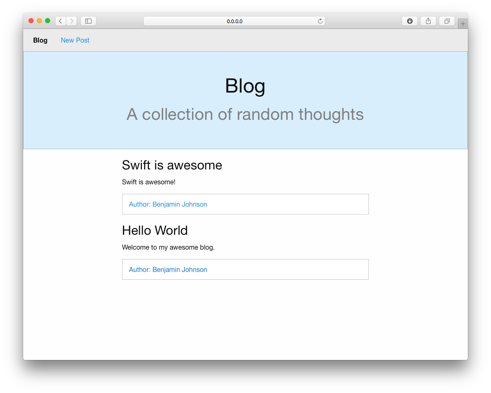

# Swift Blog
A simple blog web app written in swift with the [Perfect framework](https://github.com/PerfectlySoft/Perfect)

## Getting Started
1. Create a new directory called ‘SwiftBlog’ or any name you prefer
2. Create a new workspace in XCode called ‘SwiftBlog’
3. Open terminal and change directories to the new directory you created in step 1, for example ‘cd Desktop/SwiftBlog/‘
4. Clone the Perfect Github repo with ‘git clone https://github.com/PerfectlySoft/Perfect.git'
5. Clone SwiftBlog with ‘git clone https://github.com/BennyKJohnson/SwiftBlog.git’
6. Go back to your XCode workspace,  right click to open the context menu in Project Navigator, 	select Add files to “SwiftBlog”, make sure **Copy items into destination group's folder** is unchecked for the following
  1. Navigate to the **Perfect/PerfectServer** directory, select **PerfectServer.xcodeproj** and add
  2. Navigate to the **Perfect/PerfectLib** directory, select **PerfectLib.xcodeproj** and add
  3. Navigate to the **Perfect/Connectors/MongoDB** directory, select **MongoDB.xcodeproj** and add
  4. Navigate to the **SwiftBlog** directory, select **SwiftBlog.xcodeproj** and add
7. Change the active scheme in the toolbar to ‘SwiftBlog’. If there is no SwiftBlog scheme available, select ‘New Scheme..’ and click add
8. Click on the schema and select 'Edit Schema'
9. Change the executable to '**PerfectServer HTTP.app**' and check the **shared** checkbox
10. Make sure to start Mongo with the ‘mongod’ command in terminal and select run in XCode

